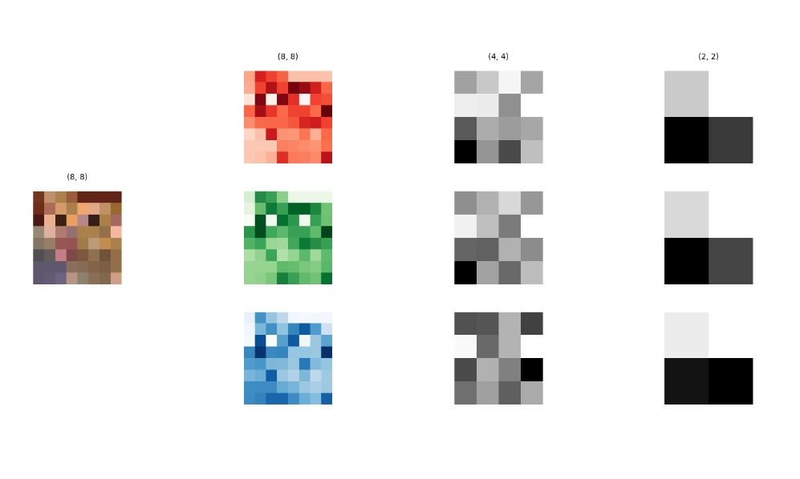
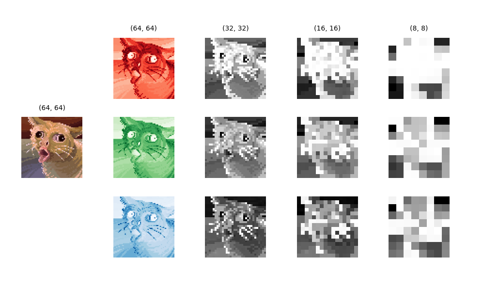

# MaxPool2D-NumPy

This repository provides an implementation of a MaxPool2D (2D MaxPooling layer) from scratch using NumPy.


## Features
- 2D maxpooling layer implementation
- Support for both single-channel and multi-channel images/feature maps
- Customizable filter size, stride, and padding
- Efficient computation using NumPy

## Dependencies and Installation
- Python 3.12.3

- Install requirements: `pip install -r requirements.txt`

## Implementation
```py
def maxpool2d(
    image: np.ndarray,
    kernel_size,
    stride=None,
    padding=0,
) -> np.ndarray:
    """
    Perform a 2D MaxPool operation

    Args:
        image (np.ndarray): Input image
        kernel_size (int or tuple[int, int]): Size of the maxpooling window
        stride (int, optional): Stride value for the maxpooling operation. Default value is kernel_size.
        padding (int, optional): Padding value for the input image. Default is 0.

    Returns:
        np.ndarray: Resulting output of the maxpooling operation.


    Raises:
        TypeError: If `image` is not of type `numpy.ndarray`.
        ValueError: If `kernel_size` is invalid.
    """
```

## Understanding 2D Maxpooling

### Terminology

|Terms|Explainations   |Variables   |
|---|---|---|
|__input__|An image of size (`height`, `width`, `channels`) represents a single instance of an image. It can be thought of as a collection of `channels` 2D matrices, each of size (`height`, `width`), stacked together.|`in_channel`=`channels`|
|__padding__|Technique of adding extra border elements to the __input__ data before applying a __convolution__ operation. It helps preserve spatial dimensions and prevents the __output__ from being smaller than the __input__.|`padding`|
|__kernel__|TODO|`kernel_size`, `stride`|
|__maxpool__|TODO|
|__ouput__|TODO|`out_channels`|

### Output Sizing Calculation
```py
output_height = (input_height - kernel_height + 2 * padding) / stride + 1
output_width = (input_width - kernel_width + 2 * padding) / stride + 1
```

## Results of 2D MaxPooling 

|2 `maxpool2d` layers|3 `maxpool2d` layers|
|:---:|:---:|
|`kernel_size` = 2, `stride` = 2, `padding` = 0|`kernel_size` = 2, `stride` = 2, `padding` = 1|
|||


## More on this topic
- [CNN Explainer](https://poloclub.github.io/cnn-explainer/)
- [PyTorch MaxPool2D](https://pytorch.org/docs/stable/generated/torch.nn.MaxPool2d.html)
- [Dilation Visualization](https://github.com/vdumoulin/conv_arithmetic/blob/master/README.md)

